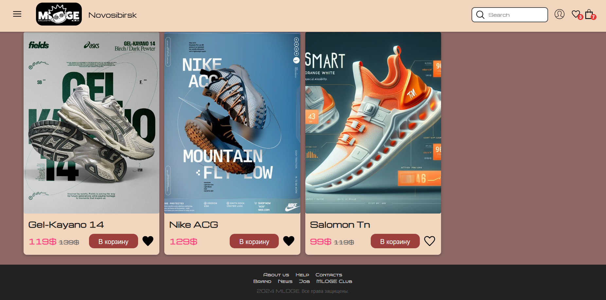
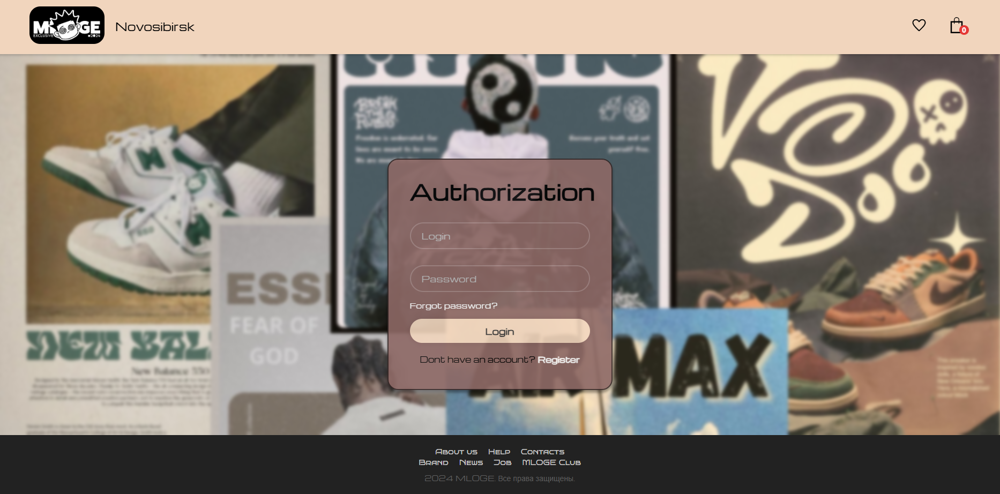
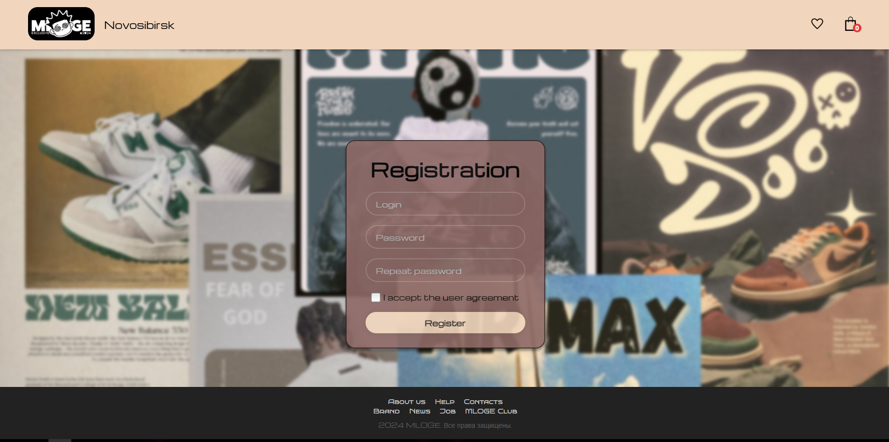
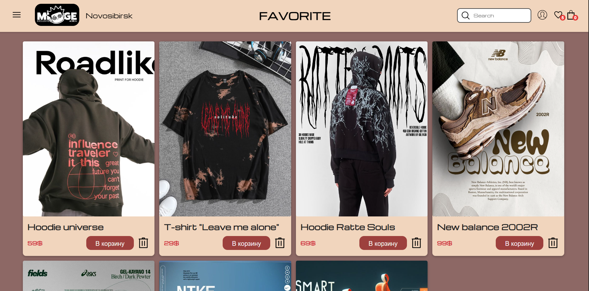
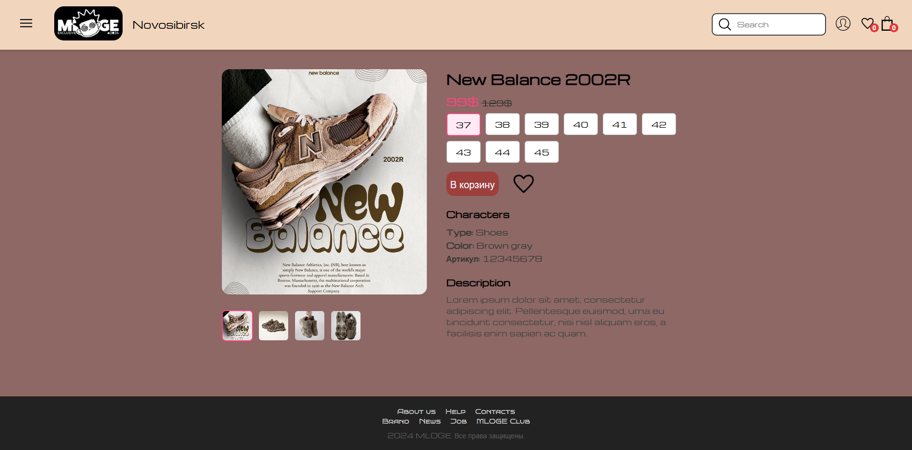
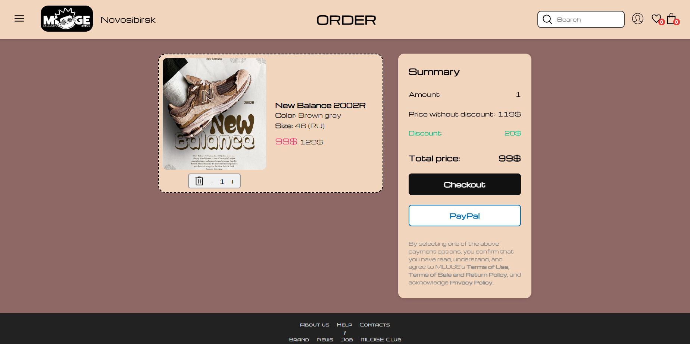

  <h1>MLOGE Shop website</h1>

MLOGE Shop - это вёрстка сайта магазина одежды с несколькими страницами

### Главная страница - index.html
Главная страница с:
- Карточками товаров, ценами, описанием и кнопками лайка и добавлания в корзину;
- логотипом магазина, городом;
- кнопками навигации для перехода в профиль, избранные товары, покупку;
- счётчик количества товаров в избранном и корзине;
- остальными навигационными ссылками внизу страницы

### Авторизация/регистрация - auth.html/register.html
Страница профиля:
- Форма авторизации пользователя;
- Форма регистрации если пользователь ещё не зарегистрирован

  
  

### Избранное - favorite.html
Практически ничем не отличается от основной страницы
-На карточках есть кнопка для удаления товара из избранного

### Страница товара - itemPage.html
Страница товара вллючает:
- Несколько фотографий товара, которые можно переключать;
- Описание товара, его цвет, размеры, категория товара;
- Кнопки выбора размера;
- Кнопки добавления в корзину и в избранное;

### Страница покупки товаров - order.html
- Карточка товара с его описанием, цветом, размером и ценой;
- кнопки для изменения количества товара или его удаления из корзины;
- панель с оплатой товара, его суммой, скидкой и общим количеством товаров;
- кнопки выбора способа оплаты и кнопка PayPal

