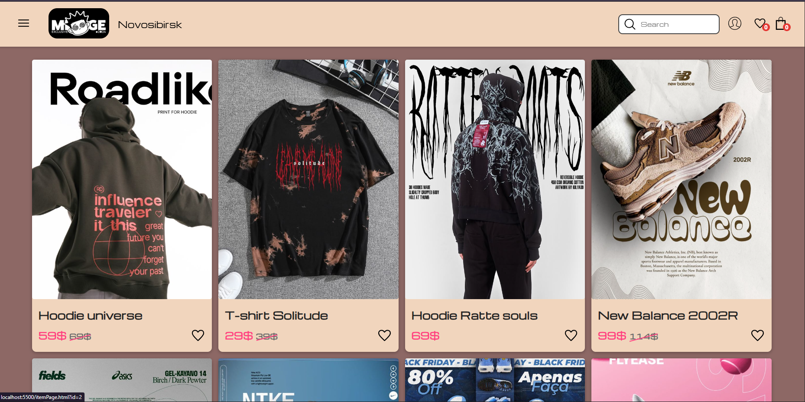
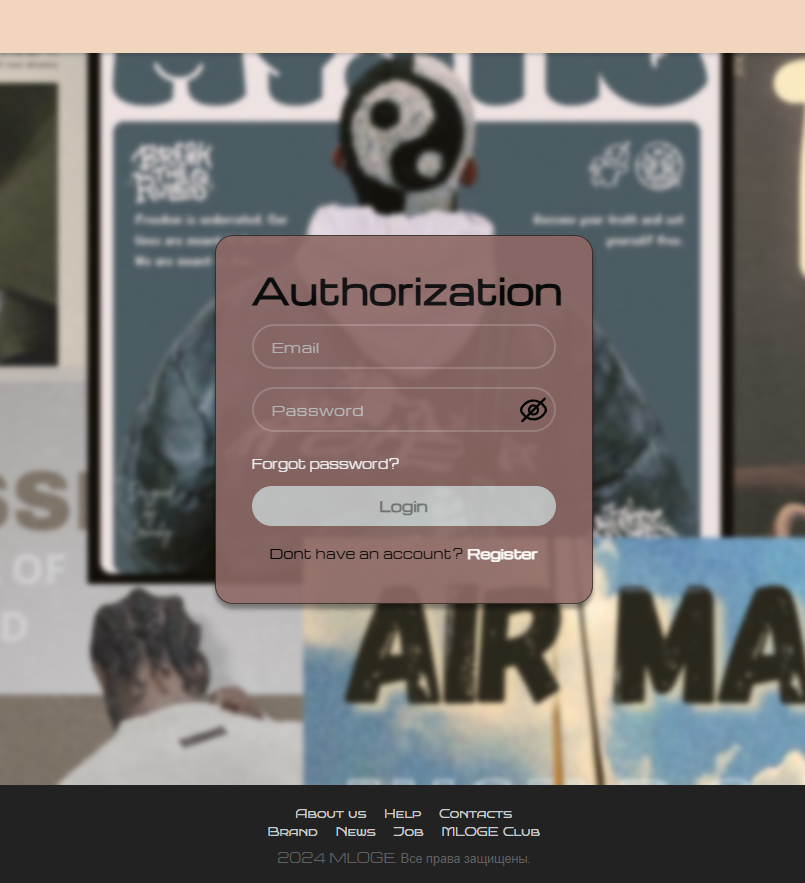
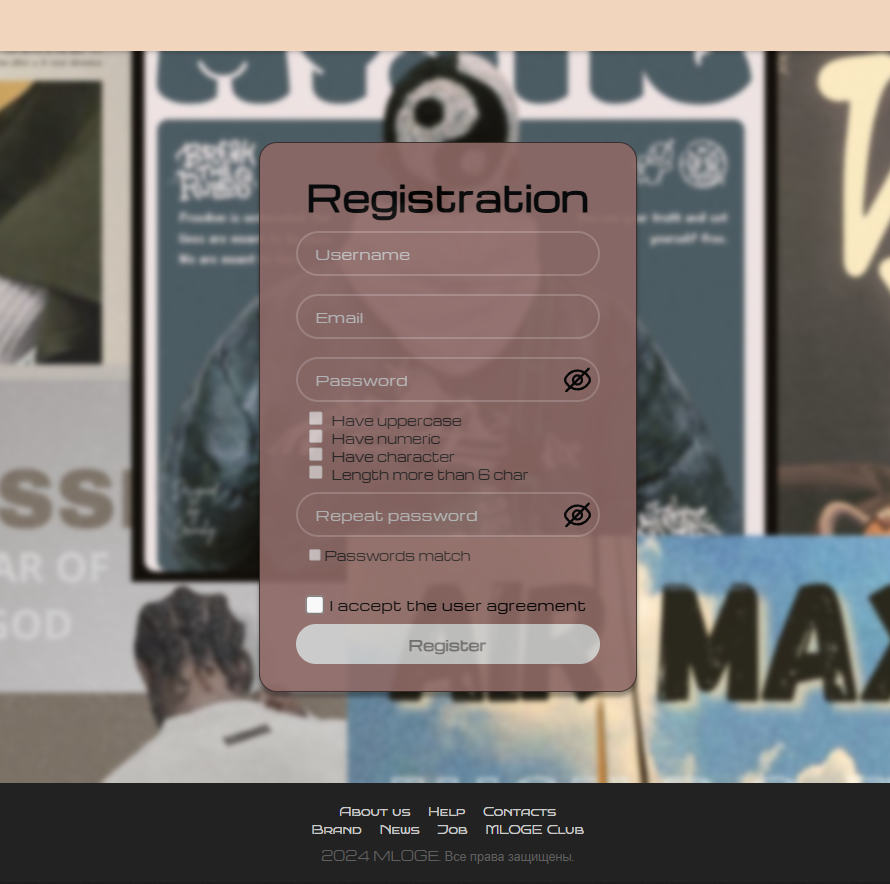
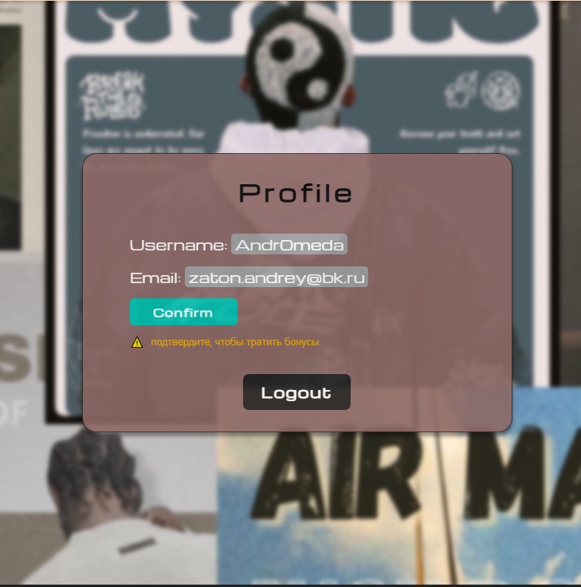
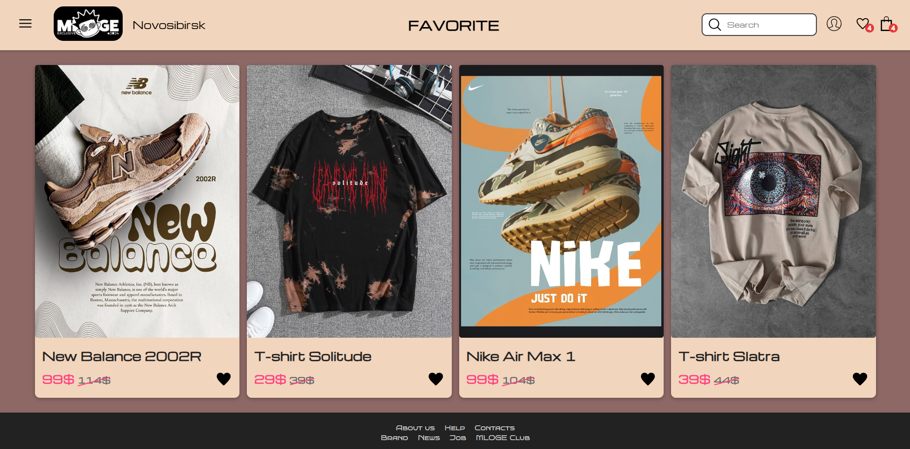
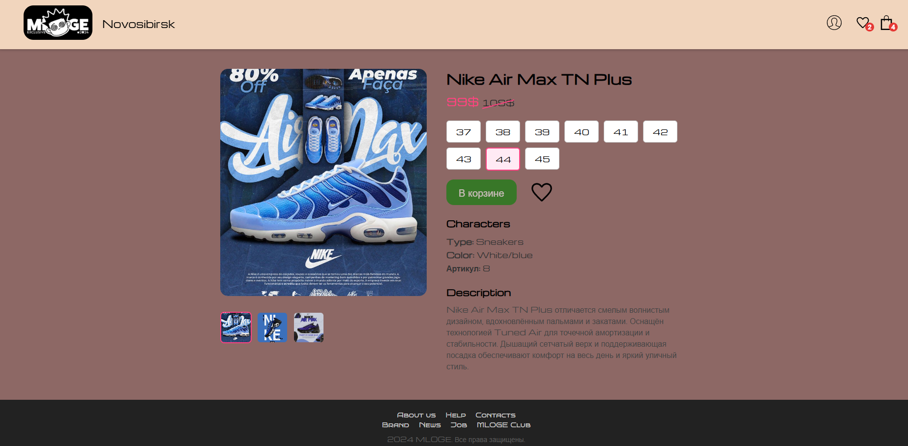
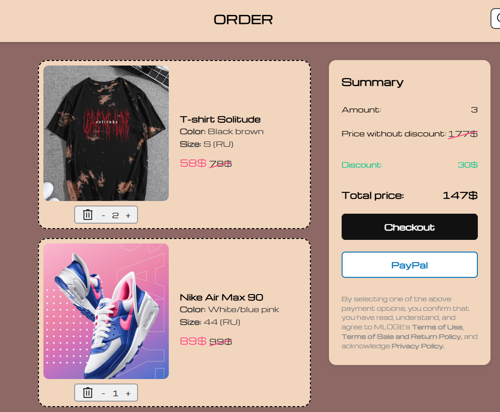

<div id="header" align="center">
  <h1>MLOGE Shop website</h1>
</div>

***MLOGE Shop*** - это вёрстка сайта магазина одежды с несколькими страницами. 
Страница с товарами и выбор категории товаров. Страница с конкретным товаром и информацией. 
Регистрация/аутентификация, страница профиля. Добавление товаров в избранные и корзина товаров.

## Что сделано и как?

***MLOGE Shop*** - это только фронтенд часть приложения, которая без запущенного [бэкенда](https://github.com/Androoomeda/ShopApi) работать не будет.
***ShopWebsite*** посылает api запросы к бэкенду и получает обратную информацию которую отрисовывает на странице.

Пример api запросов
```javascript
export const getProducts = () => apiRequest('/api/products');

export const getProductById = productId =>
  apiRequest(`/api/products/${productId}`, { credentials: 'include' });
```

Авторизация пользователя происходит с помощью ***JWT*** токена, хранимого в куки файлах и генерируемого на бэкенде. 

> [!NOTE]
> Неавторизованный пользователь ограничен в функционале сайта и поэтому может только смотреть товары, 
для покупки и добавления в избранного ему нужно зарегистрироваться.

## Как это выглядит?

### Главная страница - mainPage.html
- Карточками товаров, ценами, описанием и кнопкой лайка;
- логотипом магазина, городом;
- кнопками навигации для перехода в профиль, избранные товары, корзину;
- счётчик количества товаров в избранном и корзине;
- остальными навигационными ссылками внизу страницы


### Авторизация/регистрация - auth.html/register.html

- Форма авторизации пользователя;
- Форма регистрации если пользователь ещё не зарегистрирован, проверка всех полей на соответствие шаблону
<div align="center">
  
  
</div>

### Страница профиля - profile.html

Страница профиля с основной информацией о пользователе и кнопкой выхода из аккаунта.


### Избранное - favorite.html

Практически ничем не отличается от основной страницы. 
Содержит избранные товары которые можно выбирать по категории


### Страница товара - itemPage.html

**Страница товара включает**:
- Несколько фотографий товара, которые можно переключать;
- Описание товара, его цвет, размеры, категория товара;
- Кнопки выбора размера;
- Кнопки добавления в корзину и в избранное;


### Страница покупки товаров - order.html

- Карточка товара с его описанием, цветом, размером и ценой;
- кнопки для изменения количества товара или его удаления из корзины;
- панель с оплатой товара, его суммой, скидкой и общим количеством товаров;
- кнопки выбора способа оплаты
